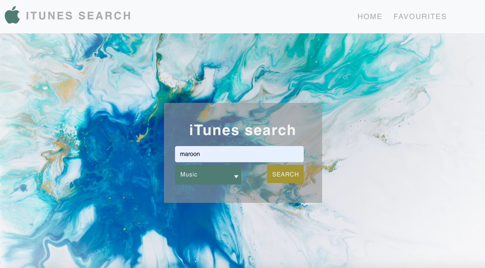
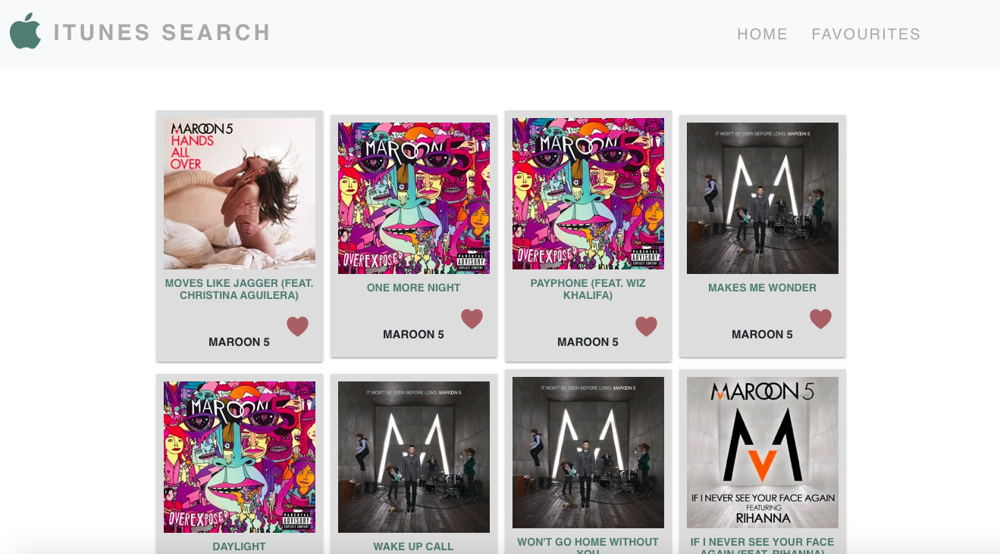
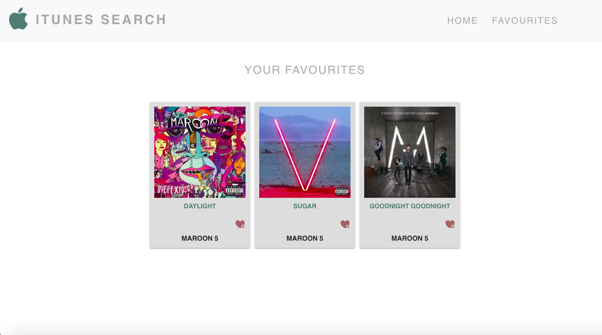

# iTunes Search App - Fullstack (React, Node & Express)

## Installation

Server-side installation:

Navigate to iTunes folder from your terminal and type in NPM install to install node_modules.

Client-side installation:

Navigate to client folder within the iTunes folder and type in NPM install to install node_modules for front end.

## Run full stack application

Run the server & client concurrently

Navigate to cd iTunes and type NPM start

Add a new terminal and navigate to cd client, type in NPM start

Server and client runs on [http://localhost:3000](http://localhost:3000)

## Test

### Snapshot test:

cd into the client folder and run the command npm test

### Unit test:

Navigate to root directory (iTunes) and run the command npm test

#### Landing Page

#### Results Page

#### Favourite Page

This code includes Helmet for security purposes
User will need to type name and type for API key to render

